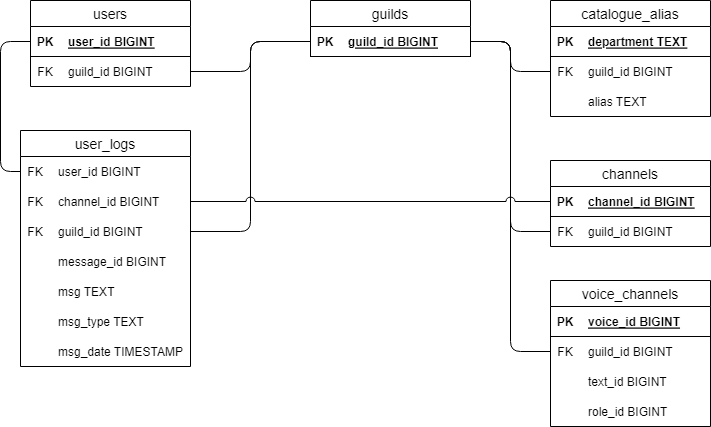

# Understanding the bot

The layout and design of the bot might initially be confusing. This document aims to provide insight into the flow and layout of the bot.

## The launcher

[launcher.py](../bot/launcher.py)

```
bot
├── launcher.py
```

The launcher serves as a small python file to launch and run the bot.

The only code that should exist in this file is anything that needs to be done prior to launching the bot.

## The bot

[peterbot.py](../bot/peterbot.py)

```
bot
├── peterbot.py
```

peterbot.py is the heart of the bot

Any code in this file should only look to setup the bot. This can include initial database actions, syncing slash commands, or simple [event handling](https://discordpy.readthedocs.io/en/latest/api.html#event-reference).

## The cogs

```
bot
├── cogs
│   ├── __init__.py
│   ├── onhandling.py
│   └── utilities.py
```

### Onhandling

[onhandling.py](../bot/cogs/onhandling.py)

Onhandling should contain code related to [events](https://discordpy.readthedocs.io/en/latest/api.html#event-reference). It might make sense to add onhandling listeners in other files, but any most onhandling should be placed here. Very simple onhandling can be placed in [peterbot.py](../bot/peterbot.py).

### Utilities

[utilities.py](../bot/cogs/utilities.py)

Utilities should contain slash commands that don't make sense to create a cog for. If you don't feel a command should be placed in a specific cog (new or current) then it can be placed here.

## The database

```
bot
├── database
│   ├── __init__.py
│   ├── loaders.py
│   ├── readers.py
│   └── writers.py
```

PeterBot makes use of a PostgreSQL database to maintain various data when the bot is shutoff.

An [ER diagram exists](../postgres/peterbot_er_diagram.drawio) and should be updated to reflect changes to the database. The database [initialization script](../postgres/sql/create_tables.sql) should also be updated.



### Loaders

[loaders.py](../bot/database/loaders.py)

Loaders should refer to any database functionality that looks to load database data. Currently this is for pulling entire tables.

### Readers

[readers.py](../bot/database/readers.py)

Readers should refer to any database functionality that looks to read specific database data. The current example is reading a single users logs.

### Writers

[writers.py](../bot/database/writers.py)

Writers should refer to any database functionality that looks to write data to the database.